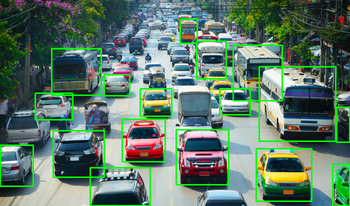
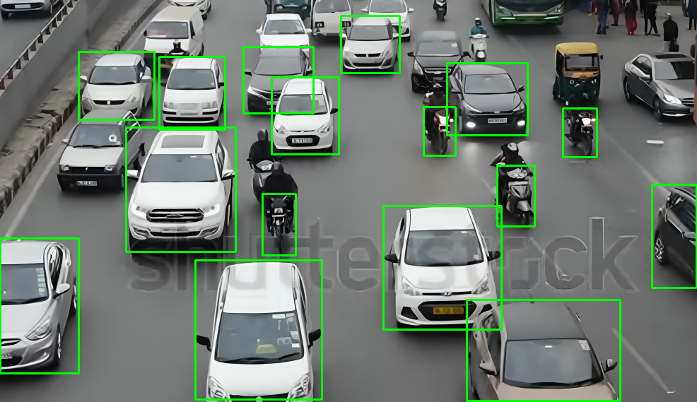
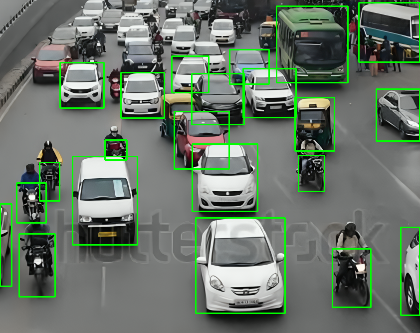
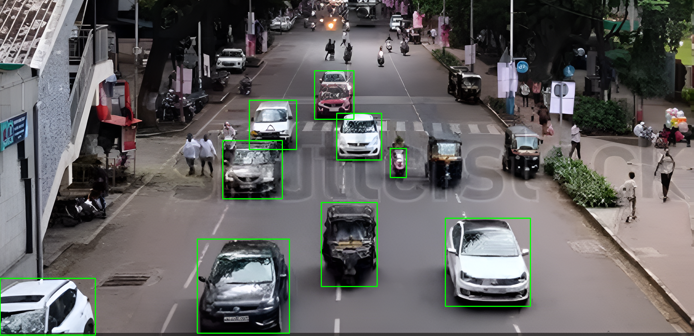

# AI-Dynamic-Traffic-Light-Optimization-for-Heavy-Routes

A smart AI-based solution for traffic management on routes with heavy traffic from different directions, featuring **real-time monitoring** and **adaptive traffic light timing** using deep learning and computer vision techniques.

---

## 🚦 Project Overview

This system leverages artificial intelligence to **dynamically optimize traffic light control** at high-traffic intersections. The goal is to reduce congestion, improve traffic flow, and ensure the prioritization of emergency vehicles when detected.

While the full solution includes multiple components, this repository currently **focuses on**:
- Vehicle detection in real-time video
- Retrieving vehicle count and estimating traffic density
- Emergency vehicle detection
- Displaying detection results and vehicle count-based timing

---

## 🎯 Key Features

- ✅ Real-time vehicle detection using **YOLOv10**
- ✅ Classification of emergency vehicles (e.g., ambulance, fire truck)
- ✅ Adaptive signal timing estimation based on vehicle count
- ✅ Support for **manual override by traffic authorities**
- ✅ Real-time processing using **OpenCV** and **FFmpeg**
- ✅ Video processing and analysis with **Scikit-Video**
- ✅ Deep learning integration with **PyTorch/TensorFlow**
- ✅ Flow diagram showing the complete pipeline
- ✅ Sample outputs: images & videos

---

## 🧪 Processed Output Images

  
  
  
  
  

---

## 🎥 Sample Output Videos

- 🔵 Vehicle Detection  
  <video width="500" controls>
    <source src="object_counting_output (1).mp4" type="video/mp4">
    Your browser does not support the video tag.
  </video>

- 🔴 Emergency Vehicle Detection  
  <video width="500" controls>
    <source src="Emergency.mp4" type="video/mp4">
    Your browser does not support the video tag.
  </video>
